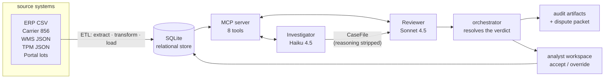

# Deduction Autopsy

[](https://github.com/vinaldsz/deduction-autopsy/actions/workflows/tests.yml)
[](pyproject.toml)
[](LICENSE)

**Two AI agents that audit each other, working a queue of retailer deduction claims.** One
gathers every source document and proposes a verdict; a second one, on a different model, that
never sees the first one's argument, independently re-checks the risky steps and confirms,
overturns, or sends it to a human. An analyst works the results in a browser and signs off.

```
CLM-002 — Target deducts $115.00, citing a "115-unit shortage"

  Investigator  INVALID   PO ordered 5 CASE = 120 EACH (case pack 24);
                          ASN and receipt both show 120 EACH. Nothing was short.
  Reviewer      CONFIRM   re-ran the conversion itself against the raw documents
  Final         INVALID   → dispute_packet.md, ready to send back
```

- [The problem](#the-problem) · [How it works](#how-it-works) · [Quickstart](#quickstart)
- [Two agents, and why](#two-agents-and-why) · [What a run produces](#what-a-run-produces) · [The analyst workspace](#the-analyst-workspace)
- [The eight scenarios](#the-eight-scenarios) · [Repo map](#repo-map) · [Documentation](#documentation) · [Testing](#testing)
- [Design decisions](#design-decisions-that-dont-bend) · [Non-goals](#non-goals) · [Future work](#future-work) · [Status](#status)

---

## The problem

When a retailer thinks a CPG supplier shorted a shipment, billed a promo wrong, or broke a
routing rule, it doesn't send an invoice — it **deducts** the money from what it already owes and
explains afterwards. A mid-sized supplier gets hundreds of these a month. Each one is a small
document-reconciliation case: pull the PO, the ship notice, the invoice, the warehouse receipt,
maybe a trade agreement; normalize units; check the timeline; decide whether the retailer is
right.

Most claims are legitimate. A meaningful share are not, and the invalid ones fail in ways that
look identical to real shortages until you look carefully:

| What it looks like | What it actually is |
|---|---|
| 115 units short | The PO is in **cases**, the ASN is in **eaches**, case pack 24. Nothing is short |
| Half the order never arrived | The shipment was **split across two ASNs** and the retailer counted one |
| Wrong item shipped | A **pre-approved substitution**, documented in the receiving notes |
| Promo discount owed | A trade agreement exists — for a **different promo code** |
| A documented shortage | Already claimed on the same PO, already settled by a credit memo. A **duplicate** |

Nobody disputes what they don't have time to examine, so valid disputes get written off. This
project is about that examination: doing it thoroughly, leaving an audit trail, and being honest
about the cases where the evidence doesn't support a verdict at all.

## How it works



Five things happen, in this order:

1. **Ingest.** An ETL reads five deliberately mismatched source systems — `$2.50` money, `01/10/2024`
   dates, `EA` for `EACH`, nested JSON, multi-line EDI-ish segments — coerces them, quarantines
   what can't be trusted, and loads a relational store with full lineage.
2. **Investigate.** The Investigator starts from a `claim_id` and *navigates the entity graph
   itself* through MCP tools: claim → PO → ASNs / invoice / receiving / prior claims. It
   normalizes every quantity to eaches, checks the timeline is physically possible, and emits a
   structured **CaseFile** with a proposed verdict.
3. **Review.** A different agent on a different model re-fetches and re-computes the highest-risk
   steps against the raw documents, and returns `CONFIRM`, `OVERTURN` or `ESCALATE`. It receives
   the CaseFile with the Investigator's **narrative reasoning removed**, as data inside XML
   delimiters — not as instructions.
4. **Resolve.** The orchestrator — code, not a model — validates the CaseFile schema, verifies the
   required tool calls actually appear in the trace, and resolves the final verdict. If a document
   is provably absent from the store, it forces `ESCALATE` no matter how confident either agent was.
5. **Decide.** An analyst opens the lot in a browser, reads the evidence, and accepts or overrides.
   The human decision is stored separately from the agents' verdict, so neither can overwrite the
   other.

Deeper: **[docs/ARCHITECTURE.md](docs/ARCHITECTURE.md)**.

## Quickstart

```bash
uv venv && uv pip install -e ".[dev]"
cp .env.example .env                    # set OPENROUTER_API_KEY — https://openrouter.ai/keys
python -m semantic_layer.etl            # build data/deductions.db from source_systems/
```

Python 3.11+. Node 22+ only if you want to run the frontend gates. The API key is needed to run
the agents; the unit tests don't need one.

**Investigate one claim, and watch the two-agent split happen:**

```bash
python -m cli.run_claim --claim-id CLM-002 --explain
```

`--explain` prints each agent's tool calls as they happen, the stripped CaseFile handed across the
boundary, and the Reviewer's per-check findings — including which ones made it re-fetch a document.

**Or open the workspace:**

```bash
uvicorn ui.server:app --host 127.0.0.1 --port 8000   # then http://127.0.0.1:8000/
```

<details>
<summary><b>Command reference</b></summary>

```bash
python -m semantic_layer.etl                  # (re)build the store; idempotent, prints a DQ report
python -m cli.run_claim --claim-id CLM-002    # one claim end-to-end
python -m cli.run_claim --claim-id CLM-002 --explain
python -m cli.run_all                         # all 8 scenarios + a pass/fail table vs ground truth
python -m cli.process_lot                     # the active lot, every unresolved claim
python -m cli.process_lot --batch LOT-2024-09-15
python -m cli.process_lot --cap 5             # limit, for a smoke test
scripts/check.sh                              # all four verification gates
```

`process_lot` is the intended post-ingestion step: run it after the ETL loads a lot, so the
workspace opens to fully-evidenced cases. It lives outside `semantic_layer/` on purpose — the ETL
stays pure and free to run, the paid OpenRouter calls stay here.

The CLI is not deprecated by the UI. It is the scriptable/CI path, and both call the same
`orchestrator/pipeline.py`.

</details>

## Two agents, and why

The Reviewer is not a second opinion for its own sake. It is a **segregation-of-duties control**:
the agent that builds a case cannot reliably grade its own work. Four things make the split real
rather than decorative:

| Control | What it does |
|---|---|
| **Different model** | Investigator on Haiku 4.5 (mechanical fetch-and-compare), Reviewer on Sonnet 4.5 (subtle trap detection). Not the same weights re-reading their own output |
| **Reasoning stripped** | The Reviewer gets the CaseFile's numbers and check results, never the narrative argument for them. A persuasive story is exactly what would anchor it |
| **Re-computation, not re-reading** | The Reviewer's prompt requires it to call the tools again and recompute — a stated conversion factor is not evidence |
| **Bounded scope** | Six named checks, and an explicit instruction not to invent a seventh dispute ground. An unbounded reviewer finds something every time, which is the same as finding nothing |

And the orchestrator holds two powers neither agent has:

- **Trace verification** — the required tool calls must appear in the *actual* tool-call trace,
  with the right arguments. Saying you normalized the units isn't the same as having done it.
- **Escalation on missing evidence** — computed from the store, before the agents run. Blockers may
  only *widen* a verdict to `ESCALATE`, never narrow it to `VALID`/`INVALID`. Deciding claims
  belongs to the agents; refusing to let a claim be decided on evidence that isn't there does not.

## What a run produces

Every run writes to `outputs/<claim_id>/<run_id>/`, never overwriting — reruns sit side by side,
with `latest` as a symlink. Real output, from `outputs/CLM-002/latest/`:

```json
{
  "claim_id": "CLM-002",
  "investigator_verdict": "INVALID",
  "reviewer_verdict": "CONFIRM",
  "final_verdict": "INVALID",
  "confidence": 0.98,
  "timestamp": "2026-07-28T06:21:50.479082+00:00",
  "usage": {
    "investigator": {"prompt_tokens": 12536, "completion_tokens": 1653},
    "reviewer":     {"prompt_tokens": 14515, "completion_tokens": 1613}
  }
}
```

| Artifact | Contents | Written |
|---|---|---|
| `verdict.json` | all three verdicts, confidence, timestamp, token usage | always |
| `reasoning_trace.json` | full message history for both agents, every tool call | always |
| `case_file.json` | the CaseFile + the Reviewer's findings | always |
| `dispute_packet.md` | normalized quantities, timeline, dispute grounds | only when final = `INVALID` |

The dispute packet is the thing you'd actually send back — from the same run:

```markdown
## Normalized Quantities (EACH)
| | Ordered | Shipped | Received | Invoiced |
|---|---|---|---|---|
| Qty | 120.0 | 120.0 | 120.0 | 120.0 |

## Dispute Grounds
- Quantities reconcile: 5 CASE ordered = 120 EACH shipped/received/invoiced
  (verified conversion factor 24)
- Timeline violation detected: invoice dated 2024-02-04 precedes receipt dated
  2024-02-05, which is physically impossible
```

Because agents can only reach data through MCP tools, `reasoning_trace.json` is a genuine audit
trail: every document either agent looked at is in it, with arguments.

## The analyst workspace

A local FastAPI app over the same pipeline, shaped around the analyst's loop — **triage → read
evidence → decide**. No build step, no framework: 20 ES modules served as static files.

```
┌──────────────────────────────────────────────────────────────────────────┐
│  LOT-2024-09-15    [To do 29] [Decided 21]   $ open · mix · oldest       │  KPI strip
├────────────────────────────┬─────────────────────────────────────────────┤
│ search  [tabs]  filters    │  Verdict: Disputable   Inv → Rev  ▓▓▓▓░ 0.9 │
│ ─────────────────────────  │  ─────────────────────────────────────────  │
│ ☐ CLM-SYN-0003  kroger 20d │  Retailer's claim: shortage · notes…        │
│ ☑ CLM-SYN-0005  publix 18d │  Source documents: PO · ASN×2 · INV · RCV   │  review pane
│ ☐ CLM-SYN-0011  kroger  9d │  Reconciliation · checks · dispute grounds  │
│   …                        │  ▸ Audit drawer (raw trace, token usage)    │
│ [bulk accept · 1 selected] │  ─────────────────────────────────────────  │
│ 25 of 50 shown      [CSV]  │  ( Accept )  ( Override ▾ + reason )        │  pinned bar
└────────────────────────────┴─────────────────────────────────────────────┘
```

What it gets right is mostly about *not lying to the analyst*:

- **KPIs that add up.** `To do` and `Decided` partition the lot by construction, and each card's
  number equals the rows you get by clicking it. `$ open`, the priority mix and the oldest open
  claim sit beside them as read-only figures, visually distinct because they aren't filters.
- **Evidence without an agent run.** The source documents panel reads straight from the store, so
  it works on a claim nobody has investigated. Evidence doesn't depend on the AI having spoken.
- **Two verdict spines, never merged.** `claim_resolutions` (what the agents concluded) and
  `claim_dispositions` (what you decided) are separate tables. Accepting snapshots the verdict you
  approved and the run it came from, so a later re-run can't rewrite what you signed — it gets a
  stale-decision badge instead.
- **Volume tools that stay honest.** Bulk action is **accept-only** and reports per claim what it
  did and did not record; there is no bulk override, because approving many claims at once is only
  defensible when you're agreeing with a verdict that already exists.
- **Keyboard path.** `j`/`k` move, `a` accept, `o` focus the override picker, `x` select, `/`
  search, `Esc` leave a field. Deliberately no key that *records* an override — that needs a
  verdict and a written reason.
- **Cost stated before you spend.** "Process lot" shows a **measured** median token cost from
  archived runs. With nothing measured it says so rather than guessing, for the same reason there
  is no ETA.
- **A run that survives a failure.** One claim erroring is reported and the lot continues; three
  consecutive failures stop it (a dead API key costs 3 round-trips, not 50). Cancel stops at the
  next claim boundary, because the one in flight is already paid for.
- **Getting work out.** **CSV** takes the filtered set unpaginated into Excel (server-side, so it
  can't quietly export only the 25 rows on screen, and with raw verdict tokens because the file
  feeds SUMIFs, not readers). **Print** takes the open claim onto paper as a dispute-file dossier.
  Light mode follows the OS.

Full route reference: **[docs/API.md](docs/API.md)**.

## The eight scenarios

Ground truth for the whole pipeline, fixed. A failing scenario means a prompt or tool is wrong —
fixture data does not move to make a test pass.

| # | Scenario | Investigator | Reviewer | The trap |
|---|---|---|---|---|
| 1 | `s01_clean_shortage` | VALID | CONFIRM | Every document genuinely agrees on a 12-unit shortage. The control case — the system has to be able to say "the retailer is right" |
| 2 | `s02_casepack_mismatch` | INVALID | CONFIRM | PO in CASE, ASN in EACH. A naive diff sees a huge shortage; normalized, the quantities match |
| 3 | `s03_split_shipment` | INVALID | CONFIRM | Shipment split across two ASNs; the retailer counted the first only |
| 4 | `s04_sequence_violation` | INVALID | CONFIRM | Invoice dated before the ship date — an impossible timeline, so the documents can't describe one consistent transaction |
| 5 | `s05_sku_substitution` | INVALID | CONFIRM | ASN SKU differs from the PO, but the receiving notes show explicit pre-approval |
| 6 | `s06_promo_billback` | INVALID | CONFIRM | A trade agreement exists — for a different promo code than the claim cites |
| 7 | `s07_duplicate_claim` | INVALID | CONFIRM | Duplicates a prior claim already resolved by credit memo |
| 8 | `s08_reviewer_overturn` | INVALID | CONFIRM | Same shape as #7 on independent data. Built to make the Investigator miss a subtly-worded prior credit — live testing found it already catches it (the story is in [`docs/SPEC.md`](docs/SPEC.md)). The `OVERTURN` path is proven directly instead: `test_reviewer_overturns_a_missed_duplicate` hands the live Reviewer a *fabricated* CaseFile against these fixtures and confirms it independently catches and overturns the duplicate |

The frozen `scenarios/*/*.json` fixtures are no longer read at runtime — they are now the ETL's
**fidelity oracle**, and a test asserts the database equals them field-for-field. That is what
stops a transform rule from quietly moving ground truth.

## Repo map

```
source_systems/     mock landing zone — ERP CSV, carrier 856, WMS/TPM/portal JSON + manifest
semantic_layer/     the ETL: extract/ (per-source parsers) → transform → load, + DQ report
mcp_server/         models, SQLite schema, the 8 MCP tools, FastMCP server
agents/             base.py (shared tool loop) + investigator.py / reviewer.py (prompts)
orchestrator/       pipeline.py (handoff + controls), completeness, output, resolutions, config
ui/                 server.py (FastAPI), queries.py (all SQL), static/ (20 ES modules, 4 layers)
cli/                run_claim · run_all · process_lot
scenarios/          the 8 frozen ground-truth fixtures (now the ETL's fidelity oracle)
tests/              pytest suites + tests/js/ (node --test)
docs/               SPEC · ARCHITECTURE · API · PLAN · GLOSSARY
outputs/            per-run artifacts (gitignored)
```

## Documentation

| Read this | For |
|---|---|
| **[docs/ARCHITECTURE.md](docs/ARCHITECTURE.md)** | How the parts fit together and why — diagrams, control points, data flow, where to add things |
| [docs/API.md](docs/API.md) | The MCP tool surface and every HTTP route |
| [docs/SPEC.md](docs/SPEC.md) | Exact contracts: schema, JSON shapes, ground truth, ETL rules |
| [docs/GLOSSARY.md](docs/GLOSSARY.md) | CPG deduction vocabulary — ASN, billback, case pack, lot, credit memo |
| [CONTRIBUTING.md](CONTRIBUTING.md) | Setup, the four gates, layer discipline, style |
| [docs/PLAN.md](docs/PLAN.md) | The layer-by-layer build plan |
| [PROGRESS.md](PROGRESS.md) | The narrative log — what each layer decided, what broke, what was corrected |
| [CLAUDE.md](CLAUDE.md) | The authoritative rulebook (also the AI-agent briefing) |

## Testing

```bash
scripts/check.sh              # all four gates — what CI runs, and what to run before committing
scripts/check.sh pytest       # or one at a time: pytest | types | js
```

One script defines every gate and CI calls it, so local and CI can't drift. It reports every
failing gate instead of stopping at the first.

| Gate | Command | Covers |
|---|---|---|
| Unit | `pytest tests/` | All Python. Mocks OpenRouter (`tests/agent_stubs.py`), runs the **real MCP server in-process** |
| Types | `pyright` | Shipped code (`tests/` excluded deliberately) |
| JS syntax | `node --input-type=module --check` per file | `node --check <file>` silently passes on these modules — see `check_js_syntax` |
| JS unit | `node --test "tests/js/**/*.test.mjs"` | `lib.js` logic, SSE parsing, and the frontend architecture invariants |

Opt-in, excluded from the default run because it spends money:

```bash
pytest tests/test_pipeline_scenarios.py -m integration -v
```

It runs the real pipeline against real models for all 8 scenarios and asserts both agents'
verdicts against `orchestrator/ground_truth.py`.

The frontend is layered so nothing imports upward —
`dom / state / stream / api → renderers → actions → app.js` — and anything that is real logic
lives in the pure, fully-tested `ui/static/lib.js`. `tests/js/architecture.test.mjs` checks what
static analysis can: acyclic graph, no upward imports, every used name imported, every module
reachable from `app.js`, `lib.js` free of browser globals. Without it, "renderers never import
actions" would be a comment.

**Two surfaces no gate can reach:** the DOM+fetch modules and the stylesheet. That's measured, not
theoretical — five layers found bugs only by driving the running app. A green check run is not the
end of a UI change.

## Configuration

Everything lives in one frozen `Settings` dataclass (`orchestrator/config.py`); every field has an
env-var override and a confirmed default. Only `OPENROUTER_API_KEY` is required. See
[`.env.example`](.env.example) for the full list — models, temperature (`0.0`), tool-loop
iterations, CaseFile-correction attempts, timeout, retry/backoff, log level, and `DEDUCTIONS_DB`.

## Design decisions that don't bend

1. **Two agents, always.** Never collapsed into one "for simplicity" — that deletes the control.
2. **MCP tools are the only data path for agents.** No fixture files, no SQL, no pre-loaded
   context. This is what makes the trace an audit trail.
3. **The eight scenarios are ground truth.** Prompts and tool logic change; fixtures don't.
4. **Agents decide the verdict; code decides whether a verdict is allowed at all.** The
   orchestrator may only widen to `ESCALATE`.
5. **The human's decision and the agents' verdict are separate records.** Neither overwrites the
   other, and the effective verdict is derived at read time.

## Non-goals

- Real EDI X12 parsing — the fixtures resemble real documents, they aren't valid EDI
- Third-party integrations (NetSuite, Shopify, Amazon…)
- Auth, multi-tenancy, or persistence beyond local files. **The web UI does not change this:** it
  binds `127.0.0.1`, has no auth, and is single-user — the CLI's trust model with a browser on it,
  not a deployment
- A product master. SKUs stay opaque codes (`SKU-001`) everywhere

## Future work

Deliberately deferred, with the reason — [`CLAUDE.md`](CLAUDE.md)'s "Explicit out of scope" is
authoritative.

- **Wiring the ETL's quarantine signals into escalation.** Escalation currently sees documents that
  are *absent* from the store, but a row the ETL **rejected** is invisible to it: `reject_rows`
  records only batch/source/raw_row/reason, so nothing ties a quarantined row back to a `claim_id`.
  Doing it properly means new columns and a loader backfill — an ETL schema change, which is why it
  wasn't bolted onto the completeness layer.
- **The run picker.** Run history is read-only; there is no way to *open* an older run, because
  rendering one run's evidence beside another run's verdict is worse than not showing it. Scoped as
  Layer 42.
- **Parallel/concurrent orchestration.** Claims run sequentially.
- **Incremental / CDC extraction.** Extraction reads whole source files each run. Real DE depth,
  but it changes nothing the reconciliation demo exercises. (The *load* side is already incremental
  merge-upsert by PK.)
- **A genuinely transient landing zone.** `source_systems/` is git-tracked for reproducibility
  rather than being a drop-and-archive feed.
- **SKU-to-product-name mapping.** Display-only, cosmetic for dispute packets.
- **API-facing deployment concerns** — auth, per-IP rate limiting, per-user cost caps. Real only if
  this ever sits beyond localhost for multiple users.

## Status

Built layer by layer; every layer had passing gates before the next one started.
[`PROGRESS.md`](PROGRESS.md) is the narrative log. This table is the layer index — the only copy,
which is why `PROGRESS.md` points here.

All layers below are complete. Layer 31 was built last of its phase, after 32, because it was
gated on sign-off — it is the only layer that edits the agent prompts. **Layer 42 (the run picker)
is scoped but not built.**

<details open>
<summary><b>Layer index</b></summary>

| Layer | What | Status |
|---|---|---|
| 1 | `mcp_server/models.py` + UOM conversion table | ✅ |
| 2 | 7 scenario fixtures + fixture validation tests | ✅ |
| 3 | `mcp_server/fixtures.py` + `mcp_server/tools/` | ✅ |
| 4 | `mcp_server/server.py` (FastMCP) | ✅ |
| 5 | `agents/base.py` — shared tool loop | ✅ |
| 6 | `agents/investigator.py` + `agents/reviewer.py` (system prompts) | ✅ |
| 7 | `orchestrator/pipeline.py` + `orchestrator/output.py` | ✅ |
| 8 | `cli/run_claim.py` + `cli/run_all.py` | ✅ |
| 9 | Integration tests + README | ✅ |
| 10 | `scenarios/s08_reviewer_overturn/` (8th scenario) | ✅ |
| 11 | CLI demo mode (`--explain`) | ✅ |
| 12 | `orchestrator/config.py` (consolidated settings) | ✅ |
| 13 | Retry/backoff + timeout around OpenRouter calls | ✅ |
| 14 | Token/cost usage capture | ✅ |
| 15 | CI (`.github/workflows/tests.yml`) | ✅ |
| 16 | Structured logging | ✅ |
| 17 | Non-overwriting output runs (`--run-id` + `latest`) | ✅ |
| 18 | Prompt-injection regression test | ✅ |
| 19 | Web UI — FastAPI investigate endpoint | ✅ |
| 20 | Web UI — SSE streaming endpoint | ✅ |
| 21 | Web UI — static frontend (`ui/static/`) | ✅ |
| 22 | Web UI — UI tests (`tests/test_ui_server.py`) | ✅ |
| 23 | Data model & source-mapping design (schema + `mcp_server/db.py`) | ✅ |
| 24 | Heterogeneous source-system fixtures + generator (`source_systems/`) | ✅ |
| 25 | ETL Extract — per-source parsers (`semantic_layer/extract/`) | ✅ |
| 26 | ETL Transform + Data Quality (`transform.py`, `dq_report.py`) | ✅ |
| 27 | ETL Load — merge-upsert + lineage + batch gate; fidelity oracle | ✅ |
| 28 | DB-backed `FixtureLoader` + document tools (scenario-less) | ✅ |
| 29 | Scenario-less pipeline + CLI + resolution persistence | ✅ |
| 30a | Synthetic daily lot (~50 claims) — volume for the worklist | ✅ |
| 30b | Dashboard + daily-lot worklist UI (`ui/queries.py`) | ✅ |
| 31 | Universal completeness check + ESCALATE on missing source data | ✅ |
| 32 | Analyst review workspace — evidence-first UI + human decisions | ✅ |
| 33 | JS test harness + render hygiene (`tests/js/`, `ui/static/lib.js`) | ✅ |
| 34 | Decision integrity — accept as a snapshot, not a pointer | ✅ |
| 35 | KPIs that add up — to-do/decided partition, `v_batch_summary` dropped | ✅ |
| 36 | Verdict semantics keyed to money direction, not verdict name | ✅ |
| 37a | Query surface — total sort order, filters, filtered totals, 422 on bad input | ✅ |
| 37b | A grid you can work — PO/Age columns, sort indicators, page size, URL-hash routing | ✅ |
| 38 | Working the volume — bulk accept, keyboard path, pinned decision bar, save-and-next | ✅ |
| 39 | Explainability — reasoning, described checks, timeline, run history (`/runs`, `/trace`) | ✅ |
| — | Frontend modularization — `app.js` 1230 lines → 18 layered modules, enforced by a test | ✅ |
| 40 | Run transparency — per-claim `claim_error`, measured-spend confirm, progress, Cancel | ✅ |
| — | Layer-end verification tooling (`scripts/check.sh`, `/layer-done`, `test_invariants.py`) | ✅ |
| 41 | Export CSV, print stylesheet, light mode, density | ✅ |
| 42 | The run picker — open an older run honestly | 📋 Planned |

</details>

## License

[MIT](LICENSE) © 2026 Vinal Dsouza.
