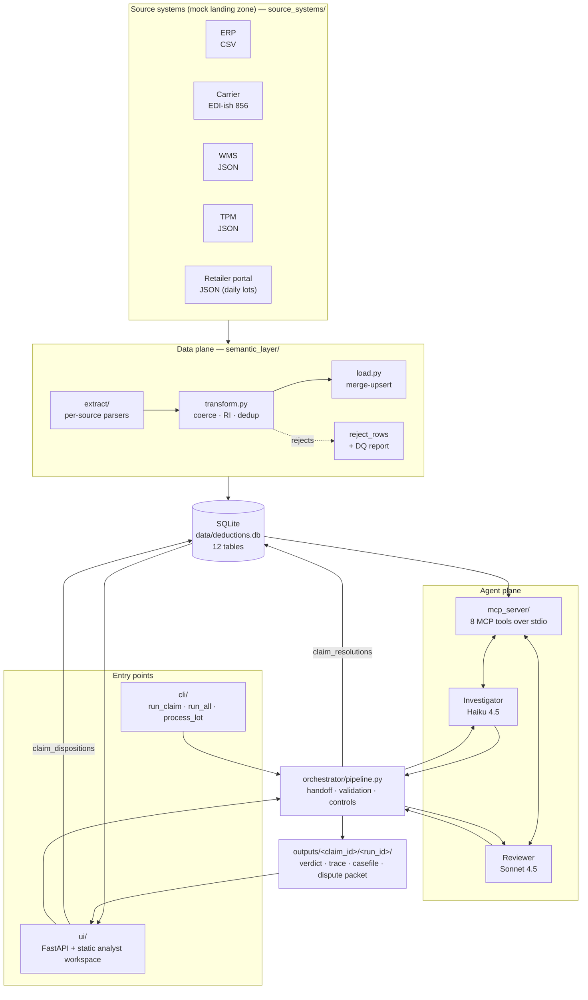
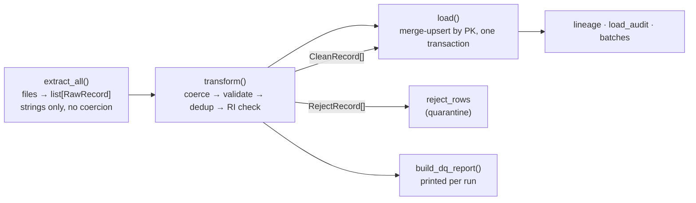
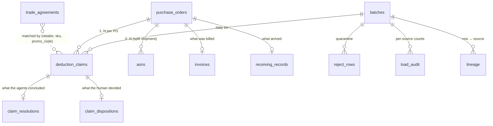

# Architecture

How Deduction Autopsy is put together, and *why* it is put together that way. Read this after
the [README](../README.md) and before changing anything.

Where the other documents fit:

| Document | Answers |
|---|---|
| [`README.md`](../README.md) | What is this, how do I run it |
| **`docs/ARCHITECTURE.md`** (this file) | How do the parts fit together, and why |
| [`docs/SPEC.md`](SPEC.md) | The exact contracts — column lists, JSON schemas, ground truth |
| [`docs/API.md`](API.md) | The HTTP + MCP tool reference |
| [`docs/PLAN.md`](PLAN.md) | The layer-by-layer build plan |
| [`PROGRESS.md`](../PROGRESS.md) | The narrative log — what each layer decided and what broke |
| [`docs/GLOSSARY.md`](GLOSSARY.md) | CPG deduction vocabulary (ASN, billback, case pack, lot…) |

---

## 1. The system at a glance

Four planes, in dependency order. Nothing on a lower plane knows the plane above it exists.



Read it as one sentence: **heterogeneous source files become a relational store; agents may
only reach that store through MCP tools; an orchestrator (not an agent) decides what the
verdict is allowed to be; every run leaves a file-system audit trail; humans work the result in
a browser.**

---

## 2. The four boundaries that shape everything

Most of this codebase's shape comes from four rules. Each one is load-bearing, and each one is
enforced by something mechanical rather than by good intentions.

| Boundary | The rule | Enforced by |
|---|---|---|
| **Segregation of duties** | The Investigator builds the case; a *separate* Reviewer on a *different model* grades it. Never one agent. | Two prompts, two model slugs, two `AgentRunner`s; `orchestrator/pipeline.py` is the only thing that sees both |
| **Data access** | Agents reach documents *only* through MCP tools — never a file path, never SQL. | Agents receive an `mcp_client` and nothing else; the DB path lives in `mcp_server/db.py` and the server subprocess |
| **Who decides** | An agent proposes; the orchestrator resolves. Code, not a model, may force `ESCALATE`. | `_resolve_final_verdict` + `orchestrator/completeness.py` (§6) |
| **Ground truth** | The 8 scenario fixtures and their expected verdicts do not move to make a test pass. | `tests/test_fixtures_db.py` (fidelity oracle) + `orchestrator/ground_truth.py` |

The pattern to notice: every boundary has a test or a module that *cannot be satisfied by
editing a prompt*. That is deliberate — see [CONTRIBUTING.md](../CONTRIBUTING.md).

---

## 3. Data plane — source systems to relational store

### The sources are deliberately hostile

Real reconciliation work is mostly fighting the shape of other people's data, so the mock
landing zone diverges from the canonical model on purpose. `source_systems/manifest.json`
declares each file, its format and its target table.

| Source | File(s) | Format | Target | Divergences the ETL has to absorb |
|---|---|---|---|---|
| ERP | `erp/purchase_orders.csv`, `erp/invoices.csv` | CSV, uppercase headers | `purchase_orders`, `invoices` | `$2.50` vs `1.00` money, `01/10/2024` vs ISO dates, renamed columns (`PO_NUMBER`, `ITEM`, `QTY`) |
| Carrier | `carrier/asn_856.txt` | `*`-delimited EDI-ish segments, blank-line separated | `asns` | Multi-line records, `EA` for `EACH`, no header |
| WMS | `wms/receiving.json` | JSON array of `{receipt: {...}}` | `receiving_records` | Nested wrapper, camelCase keys, untrimmed free-text notes |
| TPM | `tpm/trade_agreements.json` | JSON | `trade_agreements` | Standalone entity, no PO link |
| Retailer portal | `portal/claims_YYYY-MM-DD.json` | JSON, one file per day | `deduction_claims` | Daily **lots** — the file name's date becomes `batch_id` |

Extraction is generic (`RawRecord` = flat string dict + provenance); *all* the coercion,
validation and referential integrity happens in one place, `semantic_layer/transform.py`.

### The three stages, and what each is allowed to do



- **Extract** — one parser per format in `semantic_layer/extract/`. Its only job is to produce
  `RawRecord(source_file, source_row_ref, target, fields)`. Provenance is captured here, at the
  only point where it is still known.
- **Transform** — coerces (`to_cents`, `to_iso_date`, `to_uom`, `to_int`), validates against the
  Pydantic models in `mcp_server/models.py`, drops PK duplicates, and quarantines orphans whose
  FK target is absent. A bad row becomes a `RejectRecord`, never an exception: one malformed CSV
  line must not stop a lot.
- **Load** — parent tables before children, `INSERT … ON CONFLICT(pk) DO UPDATE` (SCD Type-1),
  inside a single transaction so a failed load leaves no half-written lot. Writes `lineage` (one
  row per business row → its source file + row ref), `load_audit` (read/loaded/rejected per
  source) and the `batches` row.

Re-running `python -m semantic_layer.etl` is idempotent — it refreshes the same batches rather
than appending. Extraction reads whole files every run; incremental/CDC extraction is
[future work](../README.md#future-work).

### The fidelity oracle

`scenarios/*/*.json` — the original per-scenario fixtures — are frozen in the repo and are no
longer read at runtime. They now serve as a **test oracle**: a test asserts the DB equals them
field-for-field after the ETL runs. This is what makes it safe for the ETL to be aggressive
about coercion: if a transform rule ever changed a value that ground truth depends on, that test
fails rather than the verdicts quietly drifting.

### The store

12 tables: 6 business entities mapping 1:1 to `mcp_server/models.py`, 6 operational/metadata
tables. No views (`v_batch_summary` was removed in Layer 35 — it could only aggregate one of the
two verdict spines). Money is `INTEGER` cents; quantities are `INTEGER` in their source UOM, with
conversion done at query time. Column-level detail is in
[`docs/SPEC.md` → Relational schema](SPEC.md#relational-schema--final-layer-23); the shape:



Two things in that diagram carry most of the design:

1. **`trade_agreements` is not linked by FK.** It is matched by `(retailer, sku, promo_code)` —
   which is the whole point of scenario 6, where an agreement exists but for a *different* promo
   code than the claim cites. A foreign key would have made the trap unrepresentable.
2. **`claim_resolutions` and `claim_dispositions` are separate tables.** The agents' verdict and
   the human's decision are two independent spines that never overwrite each other (§7).

---

## 4. Agent plane — the tool surface

The MCP server (`mcp_server/server.py`, FastMCP over stdio) exposes exactly 8 tools. It is
launched as a subprocess by the orchestrator with `DEDUCTIONS_DB` in its environment.

| Tool | Takes | Returns | Note |
|---|---|---|---|
| `get_deduction_claim` | `claim_id` | claim incl. `po_id` | **The entry point** — every other document tool needs the `po_id` from here |
| `get_po` | `po_id` | purchase order | |
| `get_asns_for_po` | `po_id` | `list[ASN]` | `[]`, not an error, when there are none — a split shipment is 2 rows |
| `get_invoice` | `po_id` | invoice | |
| `get_receiving_record` | `po_id` | receiving record | Its `notes` free text often decides the verdict |
| `get_trade_agreement` | `retailer`, `sku`, `promo_code` | agreement or `None` | Match is on all three |
| `list_claims_for_po` | `po_id` | `list[claim_id]` | How duplicate claims are found |
| `normalize_uom` | `qty`, `from_uom`, `to_uom`, `sku` | float in target UOM | Reads `data/sku_uom_conversions.json` |

There is no scenario parameter and no "get everything" tool: the agent starts from a `claim_id`
and **navigates the entity graph itself**. That navigation is what makes the tool-call trace a
meaningful audit trail rather than a formality — see §6's trace verification.

`agents/base.py::AgentRunner` is the shared loop: advertise the MCP tools as OpenAI-format
function schemas → call OpenRouter → execute tool calls → feed results back, up to
`MAX_TOOL_ITERATIONS`. It records a `ToolCallRecord` per call and accumulates `TokenUsage`, and
retries transient transport errors (429/5xx/timeout) with exponential backoff. Both agents are
this same class with different prompts, models and temperature 0.

---

## 5. The two-agent handoff

```mermaid
sequenceDiagram
    autonumber
    participant O as orchestrator/pipeline.py
    participant DB as SQLite
    participant I as Investigator (Haiku 4.5)
    participant M as MCP tools
    participant R as Reviewer (Sonnet 4.5)

    O->>DB: data_gaps(claim_id) — are the documents even there?
    O->>I: investigate claim_id
    loop up to MAX_TOOL_ITERATIONS
        I->>M: get_deduction_claim / get_po / get_asns_for_po / normalize_uom …
        M-->>I: document JSON
    end
    I-->>O: CaseFile JSON
    O->>O: validate schema + verify required calls appear in the trace
    alt invalid or incomplete
        O->>I: correction naming exactly what is missing (up to 3 attempts)
    end
    O->>R: strip_reasoning(CaseFile) inside &lt;case_file&gt; tags<br/>+ &lt;orchestrator_findings&gt; if any
    loop targeted spot-check
        R->>M: re-fetch and re-compute the high-risk steps
        M-->>R: document JSON
    end
    R-->>O: ReviewerOutput (6 checks + completeness, CONFIRM/OVERTURN/ESCALATE)
    O->>O: _resolve_final_verdict(investigator, reviewer, blockers)
    O->>DB: claim_resolutions
    O->>O: write artifacts to outputs/<claim_id>/<run_id>/
```

Three details in that handoff are controls, not plumbing:

- **`strip_reasoning`** — the Reviewer receives the CaseFile's numbers and checklist results with
  the `reasoning` narrative **removed**. It is grading the work, and a persuasive argument is
  exactly the thing that would anchor it.
- **`<case_file>` delimiters** — the CaseFile is embedded as *data*, and the Reviewer's prompt
  says so explicitly, because fixture `notes` and `retailer_notes` are free text a retailer wrote.
  `tests/test_prompt_injection.py` is the regression test.
- **`<orchestrator_findings>`** — blockers the orchestrator established against the store are
  handed to the Reviewer as verified fact rather than applied silently afterwards. Without this
  you get artifacts that read `CONFIRM` / all checks `PASS` / final `ESCALATE`, which is
  incoherent to whoever reads the file next.

The Reviewer's scope is fixed at **six dispute checks** — `uom`, `split_shipment`, `timeline`,
`trade_agreement`, `duplicate`, `substitution` — and its prompt forbids inventing a seventh
ground, however plausible (it is explicitly told not to re-litigate liability apportionment, the
argument it kept reaching for). An unbounded reviewer finds something every time, which is the
same as finding nothing. `review_findings` carries one further field, `data_completeness_check`,
which works differently: it reports on the `<orchestrator_findings>` block rather than on a
re-computation, which is why it is declared last and renders last in the UI's check chips.

---

## 6. Orchestration — who is allowed to decide

`orchestrator/pipeline.py::run_pipeline(claim_id)` is the single entry point behind both the CLI
and the UI. Its controls, in the order they fire:

1. **Gap detection before anything runs.** `completeness.data_gaps(claim_id)` asks the *store*
   which of this claim's required documents are absent. This is computed, never taken from
   anything a model said about itself — and it reads the DB rather than the trace because
   `get_asns_for_po` returns `[]` for a missing ASN, so a trace-derived check structurally cannot
   see one.
2. **CaseFile schema validation.** Parsed and validated against the `CaseFile` Pydantic model.
   On failure the orchestrator sends a correction naming the missing fields and forces another
   turn (up to `MAX_INVESTIGATOR_ATTEMPTS`). The Reviewer never sees an incomplete CaseFile.
3. **Trace verification.** `completeness.required_tool_calls(claim_id)` derives, per claim and
   from the store, which calls must appear in the actual `ToolCallRecord` trace with which
   arguments — e.g. `normalize_uom` when the documents disagree on UOM, `list_claims_for_po`
   when the PO has more than one claim. Unmet requirements are a *diligence* failure and are
   recoverable: correct and retry.
4. **Verdict resolution.** Blockers (absent documents, or steps never completed after retries)
   force `ESCALATE`. Otherwise:

   | Investigator | Reviewer | Final |
   |---|---|---|
   | `VALID` | `CONFIRM` | `VALID` |
   | `INVALID` | `CONFIRM` | `INVALID` |
   | `VALID` | `OVERTURN` | `INVALID` |
   | `INVALID` | `OVERTURN` | `VALID` |
   | any | `ESCALATE` | `ESCALATE` |
   | any | any, **with blockers** | `ESCALATE` |

   The override is one-directional by design: code may only *widen* to `ESCALATE`, never narrow
   to `VALID`/`INVALID`. Deciding claims belongs to the agents; refusing to let a claim be
   decided on evidence that isn't there belongs to the orchestrator.

5. **Artifacts, then persistence.** Files first, then the `claim_resolutions` row that points at
   them by `run_id`.

### Diligence vs. absence

The distinction in steps 1 and 3 is the one worth internalising, because conflating them
produces both classic failure modes:

| | Question | Cause | Handling |
|---|---|---|---|
| `required_tool_calls` | *Did the agent do the work?* | Agent skipped a step | Recoverable — correct and retry |
| `data_gaps` | *Is the data even there?* | Source system incomplete | Not the agent's fault, no retry helps → force `ESCALATE` |

A tool error (`is_error`) is treated as evidence a requirement is **unsatisfied**, never as
evidence data is missing — with a complete corpus it almost always means the agent passed a
`claim_id` where a `po_id` was required, and escalating on that would turn a recoverable typo
into a wrong verdict.

### Artifacts

Every run writes to `outputs/<claim_id>/<run_id>/`, with `latest` a symlink to the most recent.
Runs are never overwritten, so reruns sit side by side.

| File | Contents | When |
|---|---|---|
| `verdict.json` | all three verdicts, confidence, timestamp, token usage | always |
| `reasoning_trace.json` | full message history for both agents, every tool call | always |
| `case_file.json` | the CaseFile + ReviewerOutput | always |
| `dispute_packet.md` | normalized quantities, timeline, dispute grounds | only when final = `INVALID` |

`verdict.json`'s `usage` block is also what `/api/batches/{id}/run-estimate` measures a lot run's
cost from — a **measured** median rather than a guessed one.

---

## 7. Presentation plane

### Two verdict spines, one effective verdict

The single idea that keeps the dashboard coherent:

```
effective_verdict = COALESCE(claim_dispositions.decided_verdict, claim_resolutions.final_verdict)
```

`claim_resolutions` is what the agents concluded and is never rewritten by a human — that is the
audit trail, and the reason it is a separate table. `claim_dispositions` is the human's call. The
effective verdict is *derived at read time*, because a stored one makes the human's decision
invisible to every KPI and filter.

`decided_verdict` is a **snapshot** taken at decision time, not a pointer: before Layer 34,
`accept` fell through to `claim_resolutions.final_verdict`, so re-investigating a decided claim
silently changed what a human was recorded as approving. `decided_run_id` binds the decision to
the run it approved, which is what makes a later divergence detectable — surfaced as a
stale-decision badge, and deliberately *not* fed back into the effective verdict. The machine
changing its mind does not un-decide what a person signed.

### The to-do / decided partition

The worklist's status filters are SQL predicates in `ui/queries.py`, written so the arithmetic
closes **by construction**:

```
todo      = not_investigated OR awaiting_my_call     (the two halves, disjoint)
decided   = NOT todo                                 (the complement)
=> todo + decided == the lot, always
```

Every KPI card is counted with the predicate of the tab it links to, so the number on a card
always equals the rows you get by clicking it. `disputable` (`effective_verdict = 'INVALID'`) is
orthogonal to the partition — a tab with no card, because the invariant doesn't apply to it.

### The FastAPI surface

`ui/server.py` is thin on purpose: routing, SSE framing, CSV assembly. All SQL lives in
`ui/queries.py`; all pipeline work goes through `run_pipeline`. Validation is strict — an
unknown sort or filter is a `422`, never a silent fallback to defaults, because a page of
plausible-but-wrong rows with nothing on screen saying so is worse than an error. Full route
reference: [`docs/API.md`](API.md).

The batch stream survives one claim failing: a `claim_error` frame is emitted and the run
continues, stopping only after **3 consecutive** failures (a dead API key costs 3 round-trips,
not 50). Cancelling stops at the next claim boundary — the claim already in flight is paid for
either way, and killing it would leave a run directory with no `verdict.json`.

### The frontend

No build step, no framework, no `node_modules`: 20 ES modules served as static files, in four
layers. **A module may import only from a lower layer, or from its own as long as the graph stays
acyclic — never upward.** The layer of every module is declared in
`tests/js/architecture.test.mjs`'s `LAYER` map, which is the authoritative list.

```
dom / state / stream / api   →   renderers   →   actions   →   app.js (wiring + boot)
```

| Layer | Modules | Responsibility |
|---|---|---|
| 0 leaves | `lib.js`, `dom.js`, `state.js`, `stream.js`, `api.js` | Import nothing but `lib.js`, so they can never sit in a cycle's dead zone. `lib.js` is the pure-logic module: money formatting, verdict labels, keymap, URL-hash state, SSE frame parsing, query-string building — **no DOM**, fully unit-tested |
| 1 renderers | `banner.js`, `controls.js`, `queue-view.js`, `documents.js`, `evidence.js`, `decision-pane.js`, `run-bar.js` | Draw the page. They take data and callbacks, and never fetch or orchestrate |
| 2 actions | `dashboard.js`, `workspace.js`, `queue.js`, `selection.js`, `investigate.js`, `disposition.js`, `keyboard.js` | Load data and drive the renderers |
| 3 entry | `app.js` | Wiring and boot |

`tests/js/architecture.test.mjs` enforces the layering: acyclic graph, no upward imports, every
used name imported, every module reachable from `app.js`, `lib.js` free of browser globals.
That test is why the split is durable — without it, "renderers never import actions" is a
comment, and the 1230-line monolith returns one convenient import at a time.

The workspace itself is a two-pane surface shaped around the analyst's loop:

```
┌──────────────────────────────────────────────────────────────────────────┐
│  LOT-2024-09-15    [To do 29] [Decided 21]   $ open · mix · oldest       │  KPI strip
├────────────────────────────┬─────────────────────────────────────────────┤
│ search  [tabs]  filters    │  Verdict: Disputable   Inv → Rev  ▓▓▓▓░ 0.9 │
│ ─────────────────────────  │  ─────────────────────────────────────────  │
│ ☐ CLM-SYN-0003  kroger 20d │  Retailer's claim: shortage · notes…        │
│ ☑ CLM-SYN-0005  publix 18d │  Source documents: PO · ASN×2 · INV · RCV   │  review pane
│ ☐ CLM-SYN-0011  kroger  9d │  Reconciliation · checks · dispute grounds  │  (scrolls
│   …                        │  ▸ Audit drawer (raw trace, tokens)         │   independently)
│ [bulk accept · 1 selected] │  ─────────────────────────────────────────  │
│ 25 of 50 shown      [CSV]  │  ( Accept )  ( Override ▾ + reason )        │  pinned bar
└────────────────────────────┴─────────────────────────────────────────────┘
```

Getting work *out* splits deliberately in two: **CSV export** takes the filtered set unpaginated
into Excel (server-side, so it can't emit only the 25 rows on screen); **printing** takes the
open claim onto paper as a dispute-file dossier (`@media print` hides every control). The list's
route out of the app is the CSV, not the printer.

---

## 8. Cross-cutting concerns

| Concern | Where | Notes |
|---|---|---|
| Config | `orchestrator/config.py` | One frozen `Settings` dataclass, env-var overrides, module-level `SETTINGS` singleton. Defaults are the confirmed ones; see [`.env.example`](../.env.example) |
| Models & provider | OpenRouter via `openai.AsyncOpenAI` | Not the Anthropic SDK — deliberate, so both agents' models are swappable by env var. Temperature 0 |
| Retries | `agents/base.py` | Transient 429/5xx/timeout only, exponential backoff, `MAX_TRANSPORT_ATTEMPTS` |
| Logging | stdlib `logging`, one logger per module | Untrusted text (model output, retailer notes) goes through `_safe_for_log` — newlines collapsed, length capped, so a crafted note cannot forge a log line |
| Cost | `TokenUsage` per agent → `verdict.json` | The only spend estimate the UI shows is measured from archived runs |
| Secrets | `.env`, gitignored | `OPENROUTER_API_KEY` only |

---

## 9. Test topology

Four gates, defined once in `scripts/check.sh` — which is also what CI calls, so local and CI
gates cannot drift.

| Gate | Command | Covers |
|---|---|---|
| `pytest` | `pytest tests/` | Everything Python. Mocks OpenRouter (`tests/agent_stubs.py`) but runs the **real MCP server in-process** |
| `types` | `pyright` | Shipped application code (`tests/` excluded deliberately) |
| `js` syntax | `node --input-type=module --check` per file | Catches a broken module the unit tests can't import |
| `js` tests | `node --test "tests/js/**/*.test.mjs"` | `lib.js` logic, SSE frame parsing, and the architecture invariants |

Opt-in, excluded from the default run because it costs money: `pytest -m integration` runs the
real pipeline against real models for all 8 scenarios and asserts both agents' verdicts against
`orchestrator/ground_truth.py`, plus `test_reviewer_overturns_a_missed_duplicate`, which hands
the live Reviewer a *fabricated* CaseFile and proves it independently catches and overturns it.

**Two surfaces no gate can reach:** `ui/static/`'s DOM+fetch modules and the stylesheet. This is
measured, not theoretical — Layers 33, 35, 36, 37b and 38 each found bugs only by driving the
running app, three in Layer 38 alone. A green `scripts/check.sh` is not the end of a UI change.

---

## 10. Where to add things

| You want to… | Touch | Don't forget |
|---|---|---|
| Add a source system | `semantic_layer/extract/`, `source_systems/manifest.json` | A parser test; the DQ report picks it up automatically |
| Add a business field | `mcp_server/models.py`, `SCHEMA_SQL` in `mcp_server/db.py`, transform | No migration framework — see `_add_snapshot_columns` for the ALTER-and-backfill pattern |
| Add an MCP tool | `mcp_server/tools/`, register in `mcp_server/server.py` | Both agent prompts must be told it exists, or it is never called |
| Add a Reviewer check | `ReviewFindings` in `orchestrator/pipeline.py` + the Reviewer prompt | Fields render as UI check chips in declaration order; default it so an old Reviewer output still validates |
| Add a worklist filter/sort | `_STATUS_SQL` / `_SORT_SQL` in `ui/queries.py` | Whitelisted — anything unknown must stay a `422`; keep the partition arithmetic closed |
| Add frontend logic | `ui/static/lib.js` (pure) + a `tests/js` test | If it needs the DOM it belongs in a renderer/action module; declare new modules' layer in `architecture.test.mjs` |
| Add an HTTP route | `ui/server.py` (thin) + `ui/queries.py` (SQL) | `tests/test_ui_server.py`; document it in `docs/API.md` |

---

## 11. Known architectural limits

Honest list; the [README's future work](../README.md#future-work) has the full set with reasoning.

- **Sequential by construction.** Claims and scenarios run one at a time. Nothing in the design
  prevents concurrency, but nothing implements it either.
- **Single-user, localhost, no auth.** The UI binds `127.0.0.1` and is the CLI's trust model with
  a browser on it — not a deployment. No auth, no rate limiting, no per-user cost caps.
- **One SQLite file, no migration framework.** Schema changes are idempotent DDL plus a
  hand-written ALTER-and-backfill. Fine at daily-lot scale; not a warehouse.
- **Quarantined rows are invisible to escalation.** `data_gaps` sees documents *absent* from the
  store, but a row the ETL **rejected** cannot be tied back to a `claim_id` (`reject_rows` drops
  `target`/`source_row_ref`). Fixing it properly is an ETL schema change.
- **Whole-file extraction.** No watermark, no CDC. The *load* side is already incremental.
- **Opaque SKUs.** No product master, by decision. `SKU-001` stays `SKU-001` everywhere.
